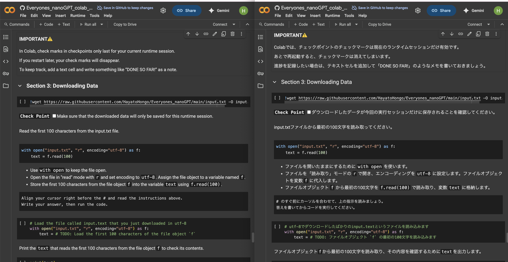

# 📘 Jupyter Translate: A Jupyter Notebook Multi-Lingual Translation Tool (ChatGPT Ready)

Quick Result: English to Japanese Translation.



---

## ✅ Overview

This project improves upon:  
https://github.com/WittmannF/jupyter-translate.git

How to use [Demo Video](https://youtu.be/magtumLJ9pA):

### 🌱 Features

- Translate your jupyter notebooks with best quality with OpenAI ChatGPT API.
- Translation from ANY language into ANY language as far as ChatGPT knows.
- Quick Demo Result: See the example from [English](https://colab.research.google.com/github/HayatoHongo/Everyones_nanoGPT/blob/main/Everyones_nanoGPT_TODO/Everyones_nanoGPT_colab_Chapter00_TODO.ipynb) to [Jpanese](https://colab.research.google.com/github/HayatoHongo/Everyones_nanoGPT_ja/blob/main/Everyones_nanoGPT_TODO_ja/Everyones_nanoGPT_colab_Chapter00_TODO_ja.ipynb).<br>
It is diffucult to evaluate translation quality unless you speak Japanse, but it is not so impotant.<br>
Please confirm that format and effect (like # for and ** ) for markdown is consistent.
- You **must** adjust the prompt for optimal translation, please keep it in mind.
- Commentout translation still has room for improvement. Currently, the prompt does not include the corresponding codes. I will soon improve later.


---

## ✅ How to Use

1️⃣ **Clone this repo**
```bash
git clone https://github.com/HayatoHongo/jupyter-translate.git
cd jupyter-translate
````

2️⃣ **Create a virtual environment**

```bash
python3 -m venv venv
```

3️⃣ **Activate the virtual environment**

```bash
source venv/bin/activate        # Mac / Linux
venv\Scripts\activate           # Windows
```

4️⃣ **Install dependencies**

```bash
pip install -r requirements.txt
```

5️⃣ **Set your OpenAI API key**

Create `.env` next to `jupyter_translate.py`:

```
OPENAI_API_KEY=sk-xxxxxxxxxxxxxxxx
```

6️⃣ **Place the notebook you want to translate**

Next to `jupyter_translate.py`, place the notebook you want to translate. :

7️⃣ **Run the translation**

Japanese → English:

```bash
python3 -m jupyter_translate YOUR_NOTEBOOK_NAME.ipynb --source ja --target en
```

> On Windows, use `python` instead of `python3`.

for more convenient command, please refer to the [original repository](https://github.com/WittmannF/jupyter-translate.git)

---

## ✅ Customizing Translation

`prompt.json` is key for tuning tone and quality.

Currently optimized for Japanese to English. Adjust it as you like.

---

## ✅ Key Points of prompt.json

* Breaks into short, natural English
* Keeps Markdown formatting
* Bright, casual tone
* Uses easy, junior-high-level English
* Adds idioms or metaphors for punch
* Uses \$ only for variables in LaTeX
* Translates 教材 as “tutorial”
* Adds \n at the end of code blocks
* Avoids using “We”

---

## ✅ Thanks

Thanks to the creator of the original repository.

---

## ✅ License

MIT License

---

✨ Happy translating your notebooks with **Jupyter Translate**! ✨

---

# 📘 Jupyter Translate: Jupyter Notebook 翻訳スクリプト (ChatGPT対応)

---

## ✅ 概要

以下のリポジトリをベースに改良しています:
[https://github.com/WittmannF/jupyter-translate.git](https://github.com/WittmannF/jupyter-translate.git)

---

### 🌱 特徴

* Markdown は **ChatGPT API (GPT-4.1)** で自然に翻訳
* コード内 `print`, `#` は **Google Translator** を使用
* **大型 Notebook も 10分程度で翻訳可能**

  * Markdown: 500セル
  * コード: 300セル

---

## ✅ 使い方

1️⃣ **リポジトリをクローン**

```bash
git clone https://github.com/HayatoHongo/jupyter-translate.git
cd jupyter-translate
```

2️⃣ **仮想環境を作成**

```bash
python3 -m venv venv
```

3️⃣ **仮想環境へ入る**

```bash
source venv/bin/activate        # Mac / Linux
venv\Scripts\activate           # Windows
```

4️⃣ **依存ライブラリをインストール**

```bash
pip install -r requirements.txt
```

5️⃣ **OpenAI API キーを設定**

`jupyter_translate.py` と同じ階層に `.env` を作成し記載:

```
OPENAI_API_KEY=sk-xxxxxxxxxxxxxxxx
```

6️⃣ **翻訳対象の Notebook (.ipynb) を配置**

`jupyter_translate.py` と同じ階層に 翻訳対象の Notebook (.ipynb) を配置:

7️⃣ **翻訳実行**

日本語 → 英語の場合:

```bash
python3 -m jupyter_translate YOUR_NOTEBOOK_NAME.ipynb --source ja --target en
```

> Windows の場合は `python` に変更可。

---

## ✅ 翻訳カスタマイズ

`prompt.json` は翻訳のトーンと品質を決める重要ファイルです。

現在は日本語→英語に特化していますが、用途に応じて自由に変更してください。

---

## ✅ prompt.json の特徴

* 短く自然な英語で分割翻訳
* Markdown フォーマット維持
* 明るくカジュアルなトーン
* 中学生レベルの簡潔な英単語を使用
* イディオム・比喩を適宜使用し、翻訳にパンチを加える
* LaTeX の \$ は変数部分だけ使用
* 教材は "tutorial" に統一
* コードブロック終了時に \n を付与
* "We" は使わない

---

## ✅ 感謝

元のリポジトリを作成してくれた作者へ感謝します。

---

## ✅ ライセンス

MIT License

---

✨ **Jupyter Translate** で快適な Notebook 翻訳ライフを！ ✨
